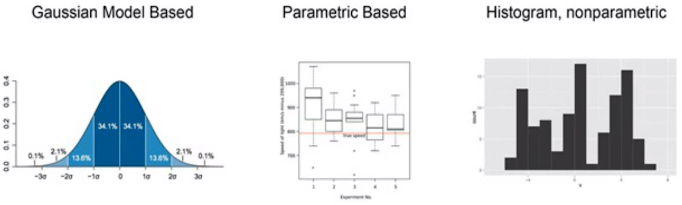
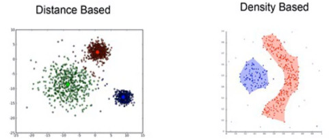

# vsangati - Anomaly Detection
> An outlier is an observation, that deviates so much from other observations as to arouse suspicion that it was generated by a different mechanism.

> Hawkins, 1980

## Data Science: Anamoly Detection(1)

## Data Science: Anamoly Detection(2)

Two ways to find anamolies with clustering
- Cluster **big amount of data** with k-means and histograms
- Apply clustering **independently to million of users**, to each identify the patterns with dbscan algorithm

[ref](https://www.oreilly.com/learning/how-to-build-an-anomaly-detection-engine-with-spark-akka-and-cassandra), [github-ref](https://github.com/ranjankumar-gh/anomaly-detection)

## Proprietary Alternatives
- [Anomali, Threatstream](https://www.anomali.com/)

## Articles / News
- [How to build an anomaly detection engine with Spark, Akka and Cassandra](https://www.oreilly.com/learning/how-to-build-an-anomaly-detection-engine-with-spark-akka-and-cassandra)
- [Probabilistic Programming for Anomaly Detection](http://blog.fastforwardlabs.com/post/143792498983/probabilistic-programming-for-anomaly-detection)
  - [Anomaly Detection & Probabilistic Programming](https://github.com/fastforwardlabs/anomaly_detection/blob/master/Anomaly%20Detection%20Post.ipynb)
  - [Graph databases catch electronic con artists in the act](http://www.ibmbigdatahub.com/blog/graph-databases-catch-electronic-con-artists-act)
